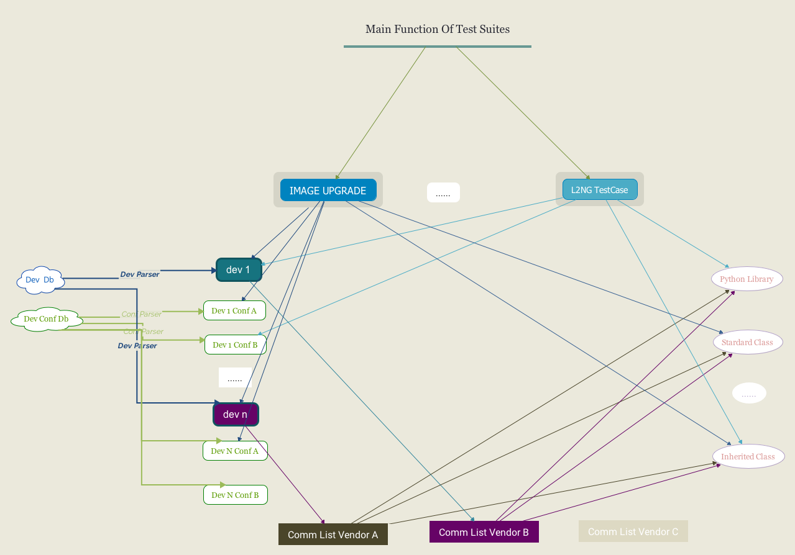

blooming
===============================

version number: 1.0.3
author: Luxebeng

Overview
--------

`blooming` Framework is a generic open source test automation framework for acceptance test-driven development (ATDD). which is operating system and application independent. The core framework is implemented using Python 3. 

Project is hosted on [GitHub](https://github.com/luxebeng/blooming) where you can find source code, an issue tracker, and some further documentation. 

Installation
------------

To install use pip:

    $ pip install blooming

Or clone the repo:

    $ git clone https://github.com/luxebeng/blooming.git
    $ python setup.py install

How does it work
----------------

The test suites is component with series independent module, and all of them can be executed in sequence. 

For each test case, device and configuration file are abstracted as an object. which is defined as a .json file, and all the operation is defined as member function of an object.

For different there are command lists on devices from different vendor, so there is a SAL layer to adapt the commands for different in future. but now it's called directly.

The simple sketch is as follows:

Example
-------

There is a detail document about L2NG test suites. please refer to documents of [L2NG Test suites](./docs/l2ng_test_sutes.md).

Contributing
------------

TBD
