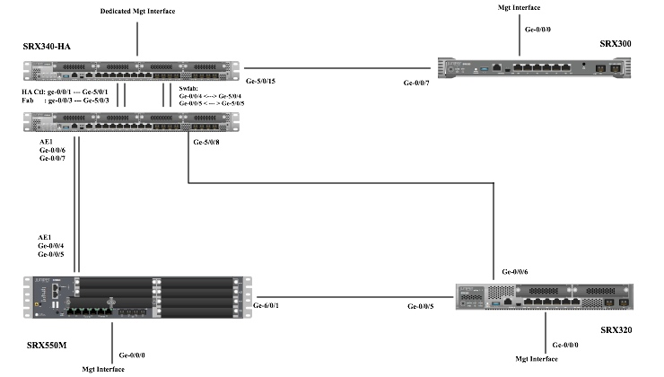

# L2 Features Test Suite

### Topology

### Device
Juniper SRX340: two piece of devices.
Juniper SRX550M: one piece of device
Juniper SRX300: one piece of device.
Juniper SRX320: one piece of device.

### Test Item
* Switching mode/TP mode

srx300 working under transparent mode. And there is a L3 interface(IRB), which should be work with the counterpart L3 interface on SRX340-HA.
and the other 3 devices are working under switching mode.

* L2 forwarding on distributed system

On SRX500M, carrying with distributed GPIM, the L2 traffic should be forwarded between basePIC port and the GPIM port.

* Mac learning/Aging

Based on all the 4 devices. The mac learning/aging mechanism should be working as expected.

* IRB interface

On the testbed, each device should be configured with a IRB interface, then each two of them should be pingable. 

* L2-HA

On this testbed, 2 piece of srx340 devices is formed into L2 HA. 
and the SWFAB interface is implemented here. It’s formed by two pair interface(ge-0/0/4 & ge-5/0/4 ; ge-0/0/5 & ge-5/0/5). Which is used to pass through the inter-node L2 traffic for L2 switch mode.

* AE interface.

On this testbed, AE interface is verified between SRX340HA and SRX550M.
The child interface pair is :
SRX340HA (ge-0/0/6 & ge-0/0/7)   <-------> SRX550M(ge-0/0/4 & ge-0/0/5)

* STP 

On the testbed, there is a ring between the 3 devices (SRX340-HA, SRX550M, SRX320). So MSTP can be configured to prevent traffic loop.

* VRRP

Based on IRB interface, VRRP feature can be verified with a VRRP group. 

* LLDP/GVRP

Based on L2 physical interface, LLDP/GVRP can be verified. 

* Other

QinQ/CFM/LFM/dot1X etc. will be verified with another sanity testbed.

### Configuration
TBD

